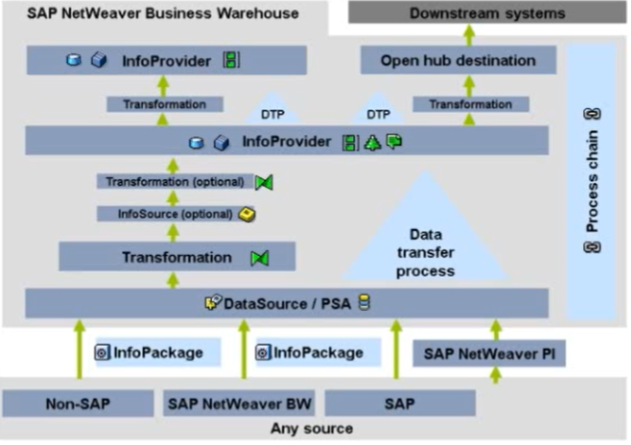

[<- Tópico anterior](./data-types.md) | 
[Próximo tópico ->](#)

### Fluxo de cargas no BW

* Cada **DataSource** já vem associado à um PSA 
* **InfoPackage** faz o disparo para o DS atualizar os dados
* **Transformation**: realocação/filtro do dado de um DS (ou DSO) para uma DSO (neste momento, regras de negócio podem ser aplicadas atraves de rotinas **ABAP**)
* Camada de **stage**: ?
* Open Hub Destination: enviar o dado para fora
* InfoSource vs DSO

### InfoObjetos
* **Cracteristicas**

    Podem ter dados armazenados em Dados Mestres.
    * **Unidades** - compreende moedas e unidades de medidas
    * **Tempo** - caracteristicas temporais (período fiscal)
* **Key Figures**

    São valores numéricos como quantidades e montantes

[<- Tópico anterior](./data-types.md) | 
[Próximo tópico ->](#)